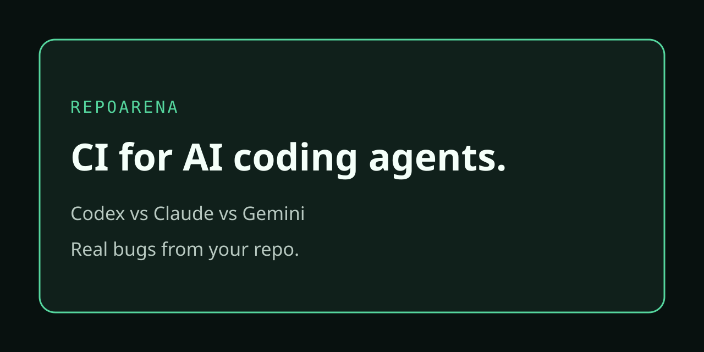

<p align="center">
  
</p>

<h1 align="center">RepoArena</h1>

<p align="center">
  <strong>CI for AI coding agents.</strong><br>
  Find the best coding agent for your repo by replaying real historical bugs.
</p>

<p align="center">
  <a href="#five-minute-quick-start">Try the demo</a> ·
  <a href="#benchmark-your-own-repository">Benchmark your repo</a> ·
  <a href="docs/local-product.md">Explore the local UI</a> ·
  <a href="CONTRIBUTING.md">Contribute</a>
</p>

<p align="center">
  <strong>Codex · Claude Code · Gemini CLI · OpenCode</strong><br>
  Local-first · No account required · Bring your own agent authentication · Apache-2.0
</p>

---

## Your codebase. Your bugs. Your benchmark.

Different coding agents perform differently on different codebases. Your Git
history already contains a useful test set: **bugs your team has actually fixed.**

RepoArena helps turn those fixes into repeatable tasks. Each agent gets a clean
workspace at the buggy revision. Public and hidden behavioral checks evaluate
the result, and you get evidence to decide which agent and configuration to use.

| What you want to know | What RepoArena shows |
| --- | --- |
| **Does it fix the bug?** | Behavioral verification, integrity checks, and regressions |
| **Will it work consistently?** | Repeated clean attempts, solve rate, and pass@k |
| **What does the result cost?** | Duration, usage, and cost when reliable pricing is available |
| **What did it actually change?** | Patches, attempt details, and reports you can inspect |

## Five-minute quick start

**Take a zero-cost tour first.** The demo replays a tiny historical regression
with two deterministic test agents. No model credentials, account, database,
or Docker are needed.

Requirements: **Git, Node.js 24, and pnpm 9.15.0**.

```sh
git clone https://github.com/Shaurya-Rathore/repoarena.git
cd repoarena
corepack enable
pnpm install --frozen-lockfile
pnpm build
pnpm demo
```

You’ll see task discovery, a benchmark, and paths to your generated reports.
The script prints the temporary demo workspace so you can inspect the results.

### A result you can understand at a glance

Illustrative summary of the deterministic demo—not a ranking of real coding
agents. Timing varies; model cost is unavailable because no model is called.

```text
One historical bug · Two test agents · One attempt each

Agent            Solved       pass@1
────────────────────────────────────
fake-perfect     1 / 1         100%
fake-noop        0 / 1           0%

Inspect the evidence:
  JSON    .repoarena/reports/<run>.json
  HTML    .repoarena/reports/<run>.html
  JUnit   .repoarena/reports/<run>.xml

Next: open the repository in the local UI.
```

## Benchmark your own repository

After the npm release, install the CLI with:

```sh
npm install --global repoarena@1.0.0
```

Before publication, use the [source setup](CONTRIBUTING.md#setup). From your
source checkout, `packages/cli/dist/index.cjs` is the built CLI executable.

**1. Find candidate bugs in your history.**

```sh
cd your-repository
repoarena init --yes
repoarena doctor
repoarena agents detect
repoarena tasks discover
```

**2. Turn a candidate fix into a task.** Replace the SHA with one returned by
discovery, then review the generated prompt and verification before running it.

```sh
repoarena tasks generate <commit-sha>
repoarena tasks list
```

You can also author a task with `repoarena tasks new <task-id>`.

**3. Run one task, then inspect the result.** Replace the task ID below with
your task. Install and authenticate the selected agent CLI first; real agent
runs consume your provider resources.

```sh
repoarena run --agent codex --tasks <task-id> \
  --runs-per-task 1 --parallel 1 --sandbox local \
  --report terminal,json,html,junit

repoarena ui
```

Ready to compare? Repeat `--agent` to run the same task against multiple agents:

```sh
repoarena run --agent codex --agent claude-code --tasks <task-id> \
  --runs-per-task 1 --parallel 1 --report terminal,json,html,junit
```

## Bring the agents you already use

| Agent | Adapter name | Before your first run |
| --- | --- | --- |
| **Codex** | `codex` | Install Codex CLI and sign in through Codex |
| **Claude Code** | `claude-code` | Install Claude Code and use its existing authentication |
| **Gemini CLI** | `gemini-cli` | Install Gemini CLI and sign in through Gemini |
| **OpenCode** | `opencode` | Install OpenCode and configure its provider authentication |

```sh
repoarena agents detect
repoarena agents inspect codex
```

RepoArena normally uses the agent CLI’s existing authentication. Model usage
is paid directly through your provider credentials (**BYOK**); you do not need
to create a RepoArena account or copy keys into RepoArena configuration.

The packaged 1.0 CLI has also completed a bounded live smoke with **Codex CLI
0.154.0**: a real workspace edit, public and hidden verification, reports, and
the local UI. That is an integration check, not a performance claim.
[See the evidence](docs/development/codex-live-smoke.md).

## Follow every result back to the patch

Run `repoarena ui` inside your repository to open the loopback-only local app.

| View | Use it to… |
| --- | --- |
| **Overview & readiness** | See repository health, missing setup, and next steps |
| **Tasks & runs** | Browse task provenance and benchmark history |
| **Attempts & diffs** | Inspect patches, verification, failures, and bounded logs |
| **Agent comparison** | Compare correctness, sample counts, duration, and available costs |
| **Optimizer** | Inspect candidates and configuration recommendations |

Terminal, JSON, HTML, JUnit, and the UI share the same canonical run result.
Unknown cost stays **unavailable**, and comparisons flag differing task evidence.

→ [Local UI guide](docs/local-product.md)

## Improve the configuration, too

Agent choice is only one variable. RepoArena’s optimizer evaluates supported
agent/model configurations within explicit trial and attempt budgets, keeps
the baseline for comparison, and exports a recommended profile.

```sh
repoarena optimize --search-space optimizer.yaml \
  --output .repoarena/optimizer-result.json \
  --profile .repoarena/recommended-profile.yaml
```

Start with the [search-space example and budget guidance](docs/local-product.md#optimizer).
Real-agent optimization consumes provider resources, just like a benchmark.

## Make agent evaluation part of CI

The [RepoArena GitHub Action](actions/repoarena/action.yml) runs benchmarks,
writes reports, and supports an explicit `fail-on-unsolved` policy. Cloud
publication is optional and off by default.

The Action lives in `actions/repoarena/`. Its runtime needs a built Action
bundle, the RepoArena CLI, and your selected coding-agent CLI on the runner.
See the [Action implementation](actions/repoarena) and
[local/BYOK workflow guide](docs/github-action-oss.md) for inputs and fork policy.

Use trusted branches or a manual workflow for credential-bearing benchmarks.
Never expose provider credentials to untrusted fork code.

## How a historical fix becomes evidence

```text
Git history → Candidate fix → Reviewed task → Clean agent attempt
                                                     ↓
Reports + local UI ← Canonical result ← Behavioral verification
```

1. **Discover** candidate fixes from repository history.
2. **Reconstruct** the buggy revision, task prompt, and verification provenance.
3. **Execute** the agent in a disposable workspace under the configured limits.
4. **Evaluate** the patch; hidden checks run after the agent process terminates.
5. **Compare** outcomes, reliability, time, and available cost evidence.

Historical reference fixes and hidden evaluator material are kept out of the
agent workspace and public reports. Docker is optional; local execution is
the default. Choose an isolation environment appropriate to the code you run.

→ [Security policy](SECURITY.md) · [Local data boundaries](docs/local-product.md)

## Documentation

| Start here | Go deeper |
| --- | --- |
| [Agent setup & troubleshooting](docs/agents.md) | [Example configuration](docs/examples/repoarena.config.yaml) |
| [Local UI, readiness & optimizer](docs/local-product.md) | [GitHub Action & fork safety](docs/github-action-oss.md) |
| [Deterministic demo](examples/demo-repository/README.md) | [1.0 release notes](docs/release-notes-1.0.0.md) |
| [Contributor setup](CONTRIBUTING.md) | [Security policy](SECURITY.md) |

Cloud services are optional. The local CLI, reports, and UI work without
PostgreSQL, Stripe, S3, hosted compute, or a RepoArena account.

## Help make agent evaluation more useful

Contributions are welcome across adapters, task discovery, reports, the local
UI, and documentation. You can develop and test with deterministic fake
agents without SaaS credentials or paid model calls.

- **Found a compatibility issue?** [Open an issue](https://github.com/Shaurya-Rathore/repoarena/issues) with your version, command, and sanitized logs.
- **Have an idea or a fix?** Start with [Contributing](CONTRIBUTING.md).
- **Find RepoArena useful?** Star the repository or share a reproducible benchmark with your team.

Licensed under [Apache-2.0](LICENSE).
